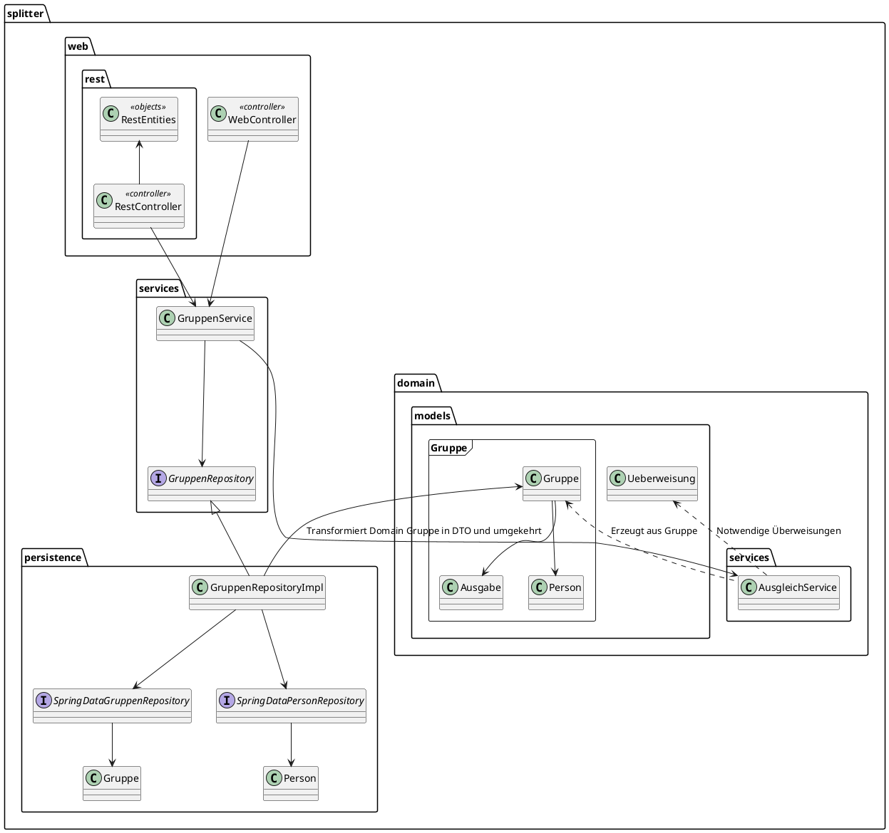

# Splitter (Gruppe 19)

# Kontextabgrenzung

## Fachlicher Kontext

### Gruppe

Zusammenschluss mehrerer **Personen** (den *Mitgliedern*). Innerhalb einer **Gruppe** können
zwischen den *Mitgliedern* **Ausgaben** getätigt werden, und somit **Überweisungen** anfallen,
um die <u>Schulden</u> <u>auszugleichen</u>.

Zur Identifikation wird ein Künstlicher *ID* Schlüssel verwendet.

Eine Gruppe kann *offen* oder nicht sein. Sie ist standardmäßig *offen* und kann nur
<u>geschlossen</u> werden.

**Personen** können von bereits existierenden *Mitgliedern* als neues *Mitglied* <u>hinzugefügt</u>
werden.

**Ausgaben** können von *Mitgliedern* <u>hinzugefügt</u> werden.

#### <u>**Person (Benutzer)**</u>

*Mitglied* einer **Gruppe**, kann an **Ausgaben** beteiligt sein.

Wird mit *Namen* identifiziert.

#### <u>**Ausgabe**</u>

Eine **Person** (der *Gläubiger*) stellt einer Gruppe von **Personen** (den *Schuldnern*) Geld aus
(den *Betrag*). Dabei muss der *Gläubiger* nicht teil der *Schuldner* sein, kann es aber.

Eine **Ausgabe** besitzt eine *Beschreibung*, der meistens den *Grund* der **Ausgabe** darstellt

#### <u>**Überweisung**</u>

Notwendige Transaktion zum <u>Ausgleich</u> der <u>Schulden</u> innerhalb einer Gruppe.

Hat eine **Person** als *Empfänger* sowie als *Sender*, sowie Geld als *Betrag*.

## Technischer Kontext

### GitHub-OAuth2

Schnittstelle um Benutzer zu Authentifizieren. Die Zuordnung erfolgt über den GitHub-Handle.

# Bausteinsicht

